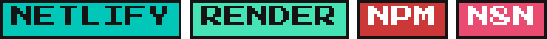

# ⚡ DUVAN MANCILLA ⚡

🟥🟧🟨🟩🟦🟪🟥🟧🟨🟩🟦🟪🟥🟧🟨🟩🟦🟪

Estudiante de Ingeniería de Sistemas en Cali, Colombia 🇨🇴 — **3 años de experiencia** construyendo software y subiendo de nivel constantemente. Piénsalo como un recorrido Pokémon: cada proyecto es un nuevo gimnasio, cada bug es un combate y cada línea de código suma experiencia. 🎮

🟦🟪🟥🟧🟨🟩🟦🟪🟥🟧🟨🟩🟦🟪🟥🟧🟨🟩

## 📇 FICHA DE ENTRENADOR

| | |
|:---|:---|
| 🧑‍💻 **Nombre** | Duvan Mancilla |
| 🔢 **N.º Pokédex** | #003 *(3 años de experiencia)* |
| 📍 **Región** | Cali, Colombia 🇨🇴 |
| 🎯 **Tipo** | Full-Stack `/` Inteligencia Artificial |
| ✨ **Habilidad** | Aprendizaje continuo — mejora con cada batalla (proyecto) |
| 🔭 **Objetivo actual** | Evolucionando hacia soluciones de IA |
| 🐞 **Debilidad** | Bugs que solo aparecen en producción |

🟥🟧🟨🟩🟦🟪🟥🟧🟨🟩🟦🟪🟥🟧🟨🟩🟦🟪

## 🎒 ENCUÉNTRAME EN LA POKÉ-RED

<table>
<tr>
<td align="center" width="150">
 

</td>
<td align="center" width="150">
 

</td>
<td align="center" width="150">
 

</td>
</tr>
</table>

🟨🟩🟦🟪🟥🟧🟨🟩🟦🟪🟥🟧🟨🟩🟦🟪🟥🟧

## 🛠️ EQUIPO DE COMBATE — Mis Skills

📦 Los badges de esta sección son pixel art generado a mano — súbelos a tu repo en <code>assets/pixel-badges/</code> (ver instrucciones al final). Para cambiar su tamaño no hace falta regenerarlos: solo edita el <code>height="24"</code> de cada <code>&lt;img&gt;</code> en este archivo.

### 🎲 Lenguajes de Programación

 <i>Ditto — se transforma en cualquier lenguaje 🔄</i>

### 🔥 Frontend Development

 <i>Charizard — interfaces con mucho fuego visual 🎨</i>

### 💤 Backend Development

 <i>Snorlax — la base robusta que nunca se cae 🛡️</i>

### 💾 Bases de Datos

 <i>Porygon — hecho enteramente de código y datos 🧬</i>

### 🧲 Herramientas

 <i>Magnemite — atrae cada herramienta que necesito 🧰</i>

  

### 🧠 Inteligencia Artificial

<i>Hoy la IA te ayuda con casi cualquier lenguaje — lo que importa es cómo la usas 🔭</i>

🟪🟥🟧🟨🟩🟦🟪🟥🟧🟨🟩🟦🟪🟥🟧🟨🟩🟦

## 📊 ESTADÍSTICAS DEL ENTRENADOR

🟥🟧🟨🟩🟦🟪🟥🟧🟨🟩🟦🟪🟥🟧🟨🟩🟦🟪

## 🚶 EL EQUIPO EN MARCHA

**¡Gracias por pasar por mi Pokédex digital! Sigamos evolucionando juntos.** ⚡

